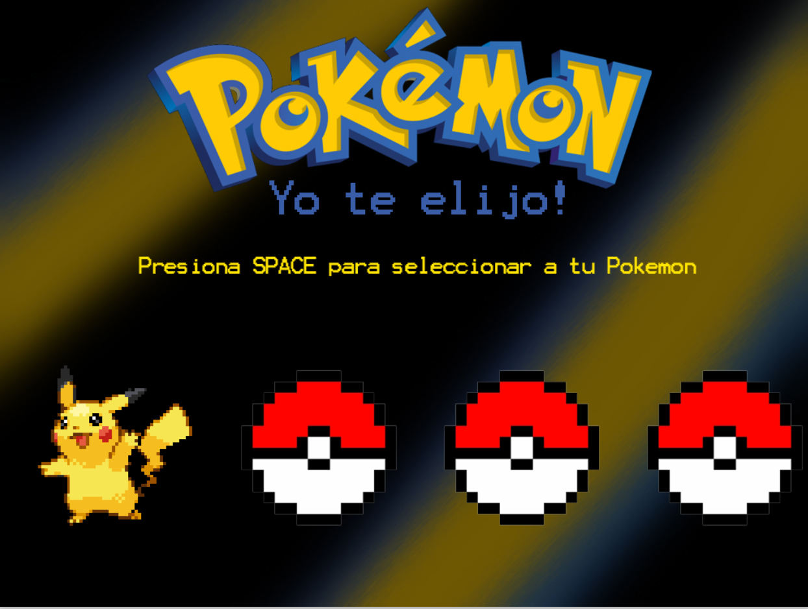
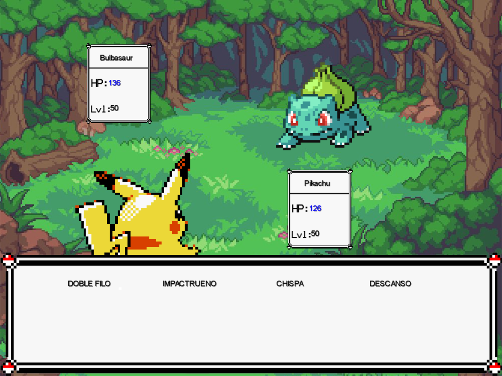
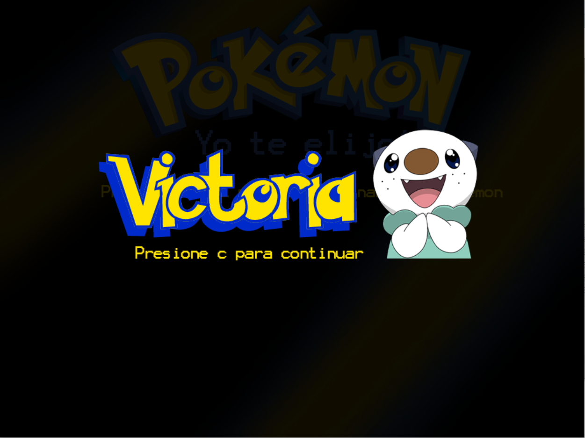
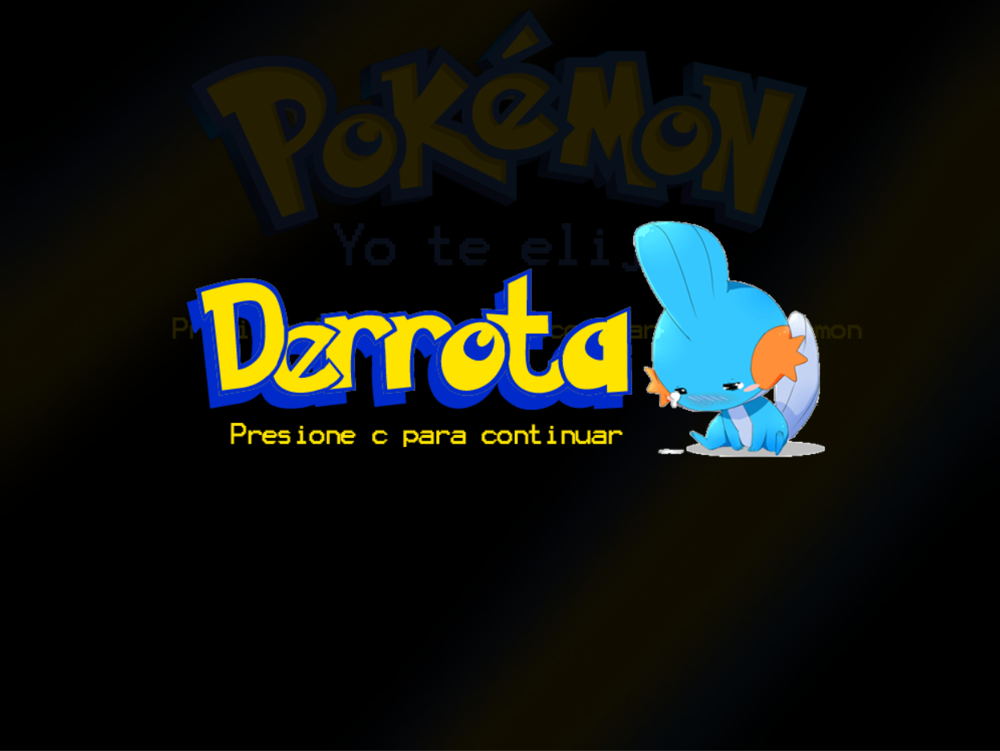

# Pokémon, yo te elijo!

## Equipo de desarrollo

- Bruno De Angelis
- Bruno Rizzo
- Simon Mirleni
- Milagros Trejo

## Capturas

## Reglas de Juego

Este es un juego de batallas pokemon.
- Se debe seleccionar un pokemon para luchar.
- Se generará un rival automáticamente.
- En un sistema de batalla por turnos, se debe elegir entre las habilidades del pokemon para ganar la partida.
- Al terminar la partida se podrá volver a empezar eligiendo un nuevo pokemon!

## Otros

- UTN FRBA - K2005
- Realizado con Wollok 2021
- Una vez terminado, no tenemos problemas en que el repositorio sea público
